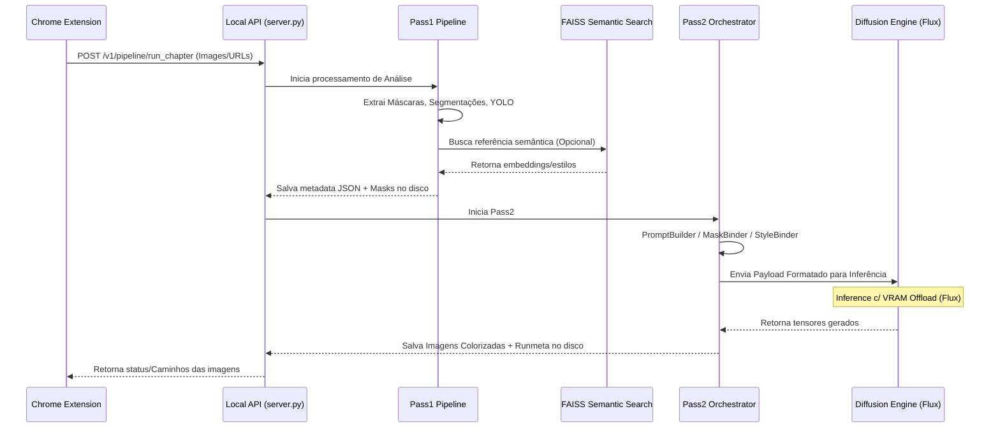

# Fase B: Implementação Real do Pass2 (Manga-Flux)

Este documento estabelece o escopo, arquitetura e os checklists da **Fase B** do projeto: a substituição do mock/dummy do Pass2 pelo uso real dos modelos de difusão (já presentes no diretório `/models`).

## 1. Visão Arquitetural e Fluxo (Pass1 -> Pass2 -> API -> Extension)

Para garantir que a integração real flua perfeitamente, o fluxo entre os componentes foi unificado:



### Detalhamento do Fluxo
1. **Extension**: A extensão atua como o veículo de orquestração do leitor. Suas duas funções principais são:
    - **Capturar a Página Alvo:** Captura ativamente a página de mangá que o usuário está lendo no site alvo.
    - **Capturar a Referência:** Fornecer e anexar a imagem de "Style Reference", que contém os personagens e o estilo de colorização que guiarão a geração. Ela empacota essas imagens/URLs e dispara as chamadas em lote (`POST /v1/pipeline/run_chapter` ou `batch`) para a API local.
2. **API**: Valida a requisição, as credenciais e encaminha os dados de imagem/estado para a camada de processamento de pipelines.
3. **Pass1**: Analisa as imagens brutas usando o YOLO e algoritmos de segmentação para achar balões e personagens, gerando as matrizes de contexto (máscaras e z-buffer) na forma de contratos `meta.json`.
4. **FAISS Retrieval (Pré-Geração)**: A busca semântica acontece *após* a extração do Pass1, mas *antes* do Pass2. As referências são adicionadas ao `meta.json`.
5. **Pass2 Orchestrator**: Para evitar que a Engine colapse fazendo o binding do metadata junto com a inferência, a arquitetura foi desmembrada em camadas:
    - **PromptBuilder**: Lê o JSON e monta os condicionamentos textuais (ex: descreve que no painel 1 há o "Personagem X", formatando a prompt que guiará o Flux).
    - **MaskBinder**: Determina exatamente para que as máscaras servimentão na estratégia de geração (inicialmente: preservação de balões/texto para evitar que a rede mexa nessa área).
    - **StyleBinder**: Prepara os embeddings ou imagens de estilo (IP-Adapter/referência). **Nota sobre Viabilidade no Flux:** Na Fase B inicial, a referência de estilo atua de forma *global* (color palette e traços gerais do personagem injetados via IP-Adapter/Image Prompt). Um "link" espacial perfeito (personagem X da ref -> bounding box Y do mangá) via difusão pura exige arquiteturas multi-adapter complexas. Inicialmente, confiaremos no `PromptBuilder` para o posicionamento de texto e na referência de estilo global para o look, estabilizando isso antes de tentar referências contextuais por máscara regional.
6. **DiffusionEngine (Agnóstica / Plug & Play)**: O papel da Engine (atualmente `FluxEngine`) é puramente de inferência. Ela recebe o payload padrão criado pelo Orchestrator e aplica técnicas de offload e inferência. **A substituição do motor:** Graças a essa barreira arquitetural imposta pelo Orchestrator, se no futuro o modelo mudar (ex: adoção do *Qwen 3* ou outra SOTA de difusão), apenas o componente final (`QwenEngine.py`, etc) precisa ser escrito, absorvendo as variáveis do Orchestrator, sem quebrar os processos do Pass1, API, JSON ou Extension.

## 2. Plano de Implementação da Fase B (Checklist)

Este checklist será **constantemente atualizado** durante a integração do Pass2 real.

### 2.1. Preparação da Infraestrutura de Inferência
- [x] Mapear todos os modelos necessários de `/models` (Base Model, VAE, ControlNet, LoRAs).
- [x] Configurar os paths absolutos/relativos corretos no `core/config.py` ou `constants.py` apontando para `/models`.
- [ ] Garantir que dependências de inferência profunda (`diffusers`, `transformers`, `torch` com CUDA, etc.) existam e funcionem no env local.

### 2.2. Estratégia Inicial e Validação da API do Modelo
Antes de projetar o pipeline completo, é crucial confirmar o comportamento do modelo *Flux* com a biblioteca Diffusers.
- [x] Confirmar pipeline primário: Testar o carregamento básico usando `DiffusionPipeline.from_pretrained(...)`.
- [x] **Teste de Sanidade de API:** Escrever um script que valide o Flux com `enable_model_cpu_offload()` rodando um `image = pipe(prompt, image=img, strength=1.0)` básico sem OOM.
- [x] **Estratégia de Geração (Fase B Inicial):** Implementar **Img2Img Full-Frame com preservação de máscara de texto**. Não usar Inpainting regional complexo nesta fase inicial.

> **💡 Alerta de Viabilidade (GGUF vs Diffusers):**
> Durante os testes de sanidade, detectou-se que a biblioteca `diffusers` padrão **não suporta carregamento nativo de pesos GGUF** do Flux (`flux-2-klein-9b-Q4_K_M.gguf`). A HuggingFace exige formato `safetensors` ou diretórios HuggingFace Hub para carregar nativamente.
> **Impacto no Plano Resolvido (Opção B Escolhida):** Como a versão GGUF quantizada reduz a necessidade de offload extremo mas não é suportada nativamente em Python, **adotamos a Opção B (ComfyUI Headless)**. A `FluxEngine` (no Manga-Flux) atuará como um cliente REST que monta um workflow JSON e o despacha para uma instância do ComfyUI rodando localmente em background.
> 
> **🔤 Nota sobre Codificador de Texto (Flux.2 Klein + Qwen3):**
> A série **Flux.2 Klein** abandonou a estrutura bimodal original do Flux.1 (T5-XXL + CLIP-L) e utiliza estritamente o modelo de linguagem **Qwen 3** para Text Encoding. O nó `CLIPLoader` dentro da Payload JSON deve sempre apontar para `qwen_3_8b_fp4mixed.safetensors`.

### 2.3. Implementação da Arquitetura do Pass2 (Orchestrator e Engine ComfyUI)
- [x] Implementar a separação em camadas (`Pass2 Orchestrator` -> `PromptBuilder`, `MaskBinder`, `StyleBinder`, `FluxEngine` via REST).
- [x] Implementar cliente em `core/generation/engines/flux_engine.py` para converter o Payload Agnóstico num "ComfyUI API Workflow JSON".
- [x] Definir o papel claro do **MaskBinder**: As máscaras na Fase B inicial serão usadas primariamente para **preservar os textos/balões originais** e evitar over-generation nessas áreas durante o Img2Img Full-Frame.
- [x] **Integração Node ComfyUI:** Garantir que o Workflow JSON submetido possua compatibilidade com os custom nodes para GGUF (ex: `UnetLoaderGGUF`).
- [x] Executar primeira rota visual de ponta a ponta (Pass1 -> JSON -> Orchestrator -> ComfyUI JSON Payload -> Geração -> Retorno).

> **⚠️ Alerta Técnico (Descobertas Sobre Colorização Img2Img no FLUX):**
> Durante os testes de integração do modelo `FLUX.2-Klein` em conjunto com o estilo LoRA `colorMangaKlein`, deparamo-nos com limitações profundas do comportamento Flow Matching da base FLUX usando `img2img` tradicional (VAEEncode -> KSampler):
> 1. **Sensibilidade do Denoise:** No `KSampler` padrão, se o denoise for `> 0.6`, o FLUX alucina e começa a gerar textos e balões em alienígena, ignorando completamente o traço original (destruição do contexto). Se o denoise for `< 0.5`, ele respeita o contexto "demais", não colorindo absolutamente nada e devolvendo uma imagem em preto e branco.
> 2. **Incompatibilidade EPS:** Tentar colocar o node `ModelSamplingDiscrete` em formato padrão `eps` causa a quebra matemática completa dos tensores latentes do FLUX (gerando ruídos de TV), pois sua base não mapeia ruído convencional, mas sim um Flow Matching (Retificadores de Fluxo). A única curadora manual de amostragem possível no base nodeset é passar o modelo nativamente para o KSampler para ele extrair as configurações do checkpoint.
> 3. **Workflow Proprietary Injection (UUID `4929e576-...`):** Ao analisar um Workflow em JSON validado visualmente funcional para colorização, descobrimos que ele **não utiliza** VAEEncode tradicional (Img2Img). A imagem não passa no denoiser. Em vez disso, a pipeline gera um Empty Latent e a imagem lineart é codificada e injetada via Conditioning (Text) juntamente com o prompt por meio de um Node Agrupado oculto de UUID `4929e576-3fd7-44d8-afdb-6b2f67305d15`. Como GroupNodes de outras instâncias mascaram seus nós internos reais (ControlNets, Pix2Pix, InpaintConditioningCustom), a reprodução exata da API Headless depende de descobrir quais os nós primários que a interface converteu para essa GroupNode.

### 2.4. Integração com Bateria de Testes / Batch
- [x] Atualizar script `run_pass2_local.py` permitindo chave `--engine flux` acessar adequadamente o pipeline real.
- [ ] Ajustar e rodar o pipeline através de `run_two_pass_batch_local.py` gerando resultados reais (batch de 3 a 5 páginas).
- [ ] Observar consistência visual nas imagens renderizadas usando sementes estáticas (`--pass2-seed-offset`).
- [ ] Revisar tempo de inferência (`duration_ms`) e garantir observabilidade.

### 2.5. Padronização Formal do Runmeta JSON
O artefato `runmeta.json` deve possuir uma estrutura de metadados exata para não perder a rastreabilidade:
- [ ] Implementar validador ou builder formal, garantindo chaves como:
```json
{
  "engine": "flux",
  "model_name": "...",
  "model_hash": "...",
  "seed": 12345,
  "guidance_scale": 7.5,
  "num_steps": 30,
  "width": 1280,
  "height": 1808,
  "duration_ms": 4235,
  "vram_peak_mb": 7420
}
```

### 2.6. Refinamento e Funcionalidades Avançadas
- [ ] Gerenciamento/Logging de erros se a API do Pass2 falhar por falta de modelo ou OOM (`Out of Memory`).
- [ ] Implementar Integração FAISS **apenas na fase de extração (pós Pass1)** alimentando o JSON. A busca semântica não fará parte do ciclo de vida da CPU/GPU durante a engine de difusão.
- [ ] Retornar metadados ricos para a Extensão Chrome sobre os parâmetros que a difusão real interpretou.

---

> **Nota:** Use os scripts em `scripts/` (como `validate_two_pass_outputs.py`) após cada milestone visual para garantir que não corrompemos o contrato do meta-json com a entrada do motor de IA.
