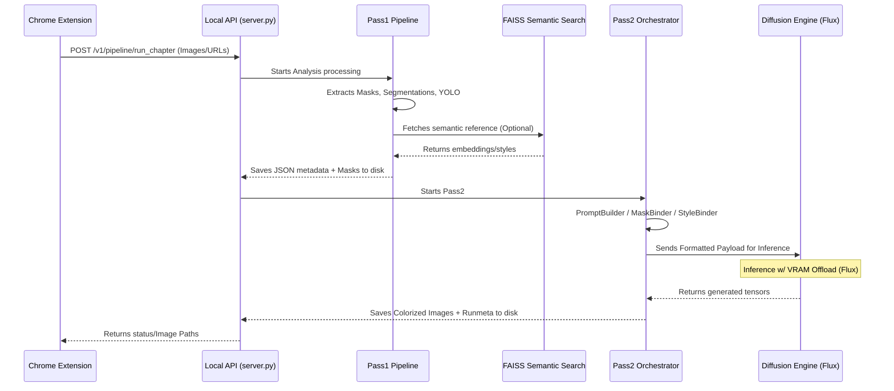

# Phase B: Real Pass2 Implementation (Manga-Flux)

This document establishes the scope, architecture, and checklists for **Phase B** of the project: the replacement of the Pass2 mock/dummy with the real use of diffusion models (already present in the `/models` directory).

## 1. Architectural Vision and Flow (Pass1 -> Pass2 -> API -> Extension)

To ensure real integration flows perfectly, the flow between components has been unified:

### Flow Breakdown
1. **Extension**: The extension acts as the reader's orchestration vehicle. Its two main functions are:
    - **Capture Target Page:** Actively captures the manga page the user is reading on the target site.
    - **Capture Reference:** Provide and append the "Style Reference" image, containing characters and colorization style to guide the generation. It packages these images/URLs and fires batch calls (`POST /v1/pipeline/run_chapter` or `batch`) to the local API.
2. **API**: Validates the request, credentials, and forwards image/state data to the pipeline processing layer.
3. **Pass1**: Analyzes raw images using YOLO and segmentation algorithms to find speech bubbles and characters, generating context matrices (masks and z-buffer) in the form of `meta.json` contracts.
4. **FAISS Retrieval (Pre-Generation)**: Semantic search happens *after* Pass1 extraction, but *before* Pass2. References are added to `meta.json`.
5. **Pass2 Orchestrator**: To prevent the Engine from collapsing by binding metadata alongside inference, the architecture is split into layers:
    - **PromptBuilder**: Reads the JSON and assembles textual conditioning (e.g., describes that panel 1 features "Character X", formatting the prompt guiding Flux).
    - **MaskBinder**: Determines exactly what masks will serve for in the generation strategy (initially: preserving speech bubbles/text to prevent the network from altering this area).
    - **StyleBinder**: Prepares style images or embeddings (IP-Adapter/reference). **Note on Flux Feasibility:** In initial Phase B, the style reference acts *globally* (color palette and general character traits injected via IP-Adapter/Image Prompt). A perfect spatial "link" (character X from ref -> bounding box Y from manga) via pure diffusion demands complex multi-adapter architectures. Initially, we will rely on `PromptBuilder` for text placement and the global style reference for the look, stabilizing this before attempting contextual references through regional masks.
6. **DiffusionEngine (Agnostic / Plug & Play)**: The Engine's role (currently `FluxEngine`) is purely inference. It receives the standard payload created by the Orchestrator and applies offload and inference techniques. **Engine Replacement:** Thanks to this architectural barrier imposed by the Orchestrator, if the model changes in the future (e.g., adoption of *Qwen 3* or another SOTA diffusion), only the final component (`QwenEngine.py`, etc) needs to be written, absorbing the Orchestrator's variables, without breaking Pass1 paths, API, JSON, or Extension.

## 2. Phase B Implementation Plan (Checklist)

This checklist will be **constantly updated** during the integration of real Pass2.

### 2.1. Inference Infrastructure Preparation
- [x] Map all required models from `/models` (Base Model, VAE, ControlNet, LoRAs).
- [x] Set correct absolute/relative paths in `core/config.py` or `constants.py` pointing to `/models`.
- [ ] Ensure deep inference dependencies (`diffusers`, `transformers`, `torch` with CUDA, etc.) exist and work in local env.

### 2.2. Initial Strategy and Model API Validation
Before engineering the full pipeline, it is crucial to confirm the *Flux* model behavior with the Diffusers library.
- [x] Confirm primary pipeline: Test basic loading using `DiffusionPipeline.from_pretrained(...)`.
- [x] **API Sanity Test:** Write an `enable_model_cpu_offload()` script testing Flux running a basic `image = pipe(prompt, image=img, strength=1.0)` without OOM.
- [x] **Generation Strategy (Initial Phase B):** Implement **Full-Frame Img2Img preserving text mask**. Do not use complex regional inpainting initially.

> **💡 Feasibility Alert (GGUF vs Diffusers):**
> During sanity tests, it was detected that standard `diffusers` library **does not support native GGUF weight loading** for Flux (`flux-2-klein-9b-Q4_K_M.gguf`). HuggingFace requires `safetensors` format or HuggingFace Hub directories to load natively.
> **Impact on the Resolved Plan (Option B Chosen):** Since the quantized GGUF version reduces the need for extreme offload but isn't natively supported in Python, **we adopted Option B (ComfyUI Headless)**. The `FluxEngine` (in Manga-Flux) acts as a REST client compiling a JSON workflow to be dispatched to a ComfyUI instance running locally in the background.
> 
> **🔤 Note on Text Encoder (Flux.2 Klein + Qwen3):**
> The **Flux.2 Klein** series abandoned the original Flux.1 dual structure (T5-XXL + CLIP-L) and strictly uses the **Qwen 3** language model for Text Encoding. The `CLIPLoader` node within the JSON Payload must always point to `qwen_3_8b_fp4mixed.safetensors`.

### 2.3. Pass2 Architecture Implementation (Orchestrator and ComfyUI Engine)
- [x] Implement layer separation (`Pass2 Orchestrator` -> `PromptBuilder`, `MaskBinder`, `StyleBinder`, REST `FluxEngine`).
- [x] Implement client in `core/generation/engines/flux_engine.py` converting the Agnostic Payload into a "ComfyUI API Workflow JSON".
- [x] Define a clear role for **MaskBinder**: Masks in Phase B will primarily be used to **preserve original texts/bubbles** avoiding over-generation in areas during Full-Frame Img2Img.
- [x] **ComfyUI Node Integration:** Ensure submitted Workflow JSON has compatibility for GGUF custom nodes (e.g., `UnetLoaderGGUF`).
- [x] Execute first end-to-end visual route (Pass1 -> JSON -> Orchestrator -> ComfyUI JSON Payload -> Generation -> Return).

> **⚠️ Technical Alert (Findings on Img2Img Colorization in FLUX):**
> During integration tests with the `FLUX.2-Klein` model and the `colorMangaKlein` LoRA style, we faced profound limitations due to FLUX's Flow Matching behavior when using traditional `img2img` (VAEEncode -> KSampler):
> 1. **Denoise Sensitivity:** In a standard `KSampler`, if denoise is `> 0.6`, FLUX hallucinates replacing text and shapes ignoring lines (context destruction). If denoise is `< 0.5`, it respects it "too much", returning an uncolored black and white image.
> 2. **EPS Incompatibility:** Setting `ModelSamplingDiscrete` to `eps` standard breaks FLUX latent tensors entirely (yielding TV noise), since its foundations map Flow Matching (Rectified Flows), not standard noise.
> 3. **The ReferenceLatent Solution (UUID `4929e576-...`):** Investigating ComfyUI GroupNodes, we found they were hiding the Custom Node `ReferenceLatent` (from the `ComfyUI_experiments` extension). Flow Matching models must start from an Empty Latent to compute trajectory properly. Instead of pushing B&W into a direct `VAEEncode` to `KSampler`, the lineart is encoded and injected **inside Conditionings (Positive/Negative)** via `ReferenceLatent`. 
> 
> **Applied Resolution:**
> Our `FluxEngine` was entirely refactored to generate API Payloads matching the `ReferenceLatent` architecture. The *KSampler* receives an `EmptyFlux2LatentImage` keeping a high Denoise. The "ghost" structural image is guided purely semiotically through Conditioning and LoRA weight, curing original lineart destruction without hallucinations.
### 2.4. Batch / Testing Integration
- [x] Update `run_pass2_local.py` script allowing `--engine flux` flag to properly hit the actual pipeline.
- [x] Adjust and run the pipeline through `run_two_pass_batch_local.py` generating real results (3 to 5-page batch).
- [x] Exert visual consistency on rendered outputs using static seeds (`--pass2-seed-offset`).
- [x] Verify inference time logging (`duration_ms`) and ensure observability.

### 2.5. Formal Runmeta JSON Standardization
The `runmeta.json` artifact must have an exact structure to maintain traceability:
- [x] Implement formal validator or builder, guaranteeing keys (Applied via `pipeline.py`).

### 2.6. Advanced Refining Features
- [x] Error Logging/Handling if Pass2 API fails due to missing model or OOM (Try/Catch in the engine).
- [~] Implement FAISS Integration strictly during extraction phase (post Pass1). -> *Paused for future architecture validation.*
- [~] Return rich metadata to Chrome Extension regarding interpreted diffusion parameters. -> *Delegated to Chrome/API Connection Phase.*

---

> **Note:** Use the scripts in `scripts/` (such as `validate_two_pass_outputs.py`) after each visual milestone to ensure the meta-json contract is not corrupted alongside AI engine inputs.
