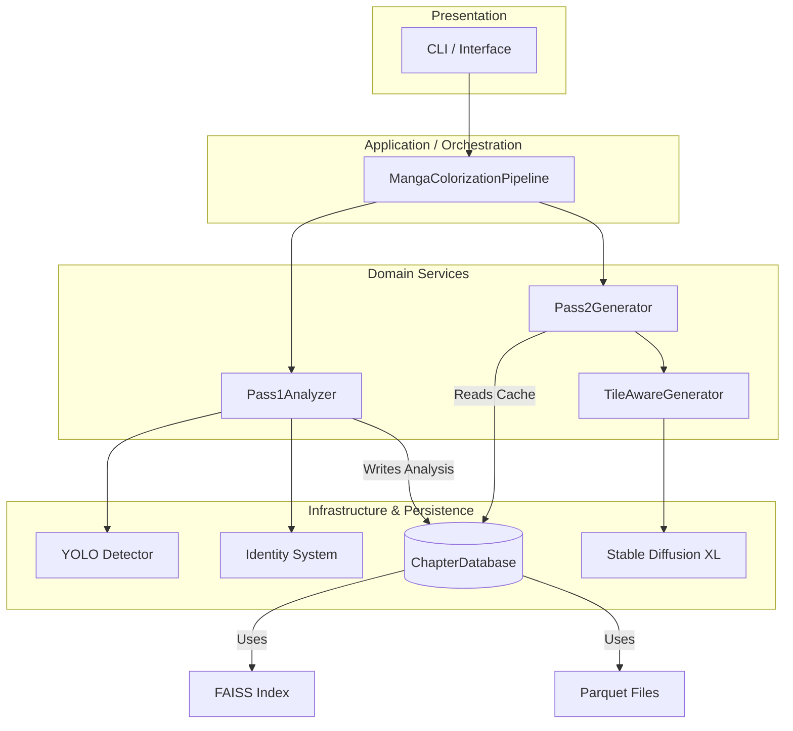

# Initial Software Design Analysis

**Date:** 2026-02-07
**Project:** MangaAutoColor Pro
**Scope:** Core Architecture (`core/`)

## 1. Executive Summary

The project is structured as a **Two-Pass Pipeline Architecture** designed to handle VRAM constraints by separating lightweight analysis (CPU/Low-VRAM) from heavy generation (High-VRAM).

- **Architectural Pattern**: Layered Pipeline (Orchestrator -> Pass 1 -> Database -> Pass 2)
- **Modularity Score**: **7/10** (Good separation of phases, but some logic leakage in persistence layer)
- **Primary Bottleneck**: `Pass2Generator` (VRAM-bound SDXL operations) directly coupled to tile management logic.

## 2. Architecture Diagram



## 3. Evaluation Findings

### 3.1 Separation of Concerns
*   **Strengths**: The separation between `Pass1Analyzer` (extraction) and `Pass2Generator` (synthesis) is excellent. It allows for "stop-and-resume" workflows and efficient resource usage.
*   **Weaknesses**: `ChapterDatabase` acts as a "Smart Repository," containing business logic for character consolidation and narrative detection, which technically belongs in a domain service.

### 3.2 Key Dependencies & Flow
*   **Flow**: Linear and acyclic (Pass 1 -> DB -> Pass 2).
*   **Coupling**: `Pass2Generator` is moderately coupled to `TileAwareGenerator`. `Pass1Analyzer` is loosely coupled to detectors via lazy loading.

### 3.3 "God Object" Candidates
1.  **`ChapterDatabase` (Moderate Risk)**:
    -   **Why**: Handles file I/O, FAISS interactions, Pandas DataFrame management, *and* complex logic like `consolidate_characters` and `detect_narrative_arcs`.
    -   **Impact**: Makes testing the persistence layer hard without mocking complex logic.

## 4. Identified Anti-Patterns & Issues

### Finding #1: Smart Repository (Logic in Database)
*   **Severity**: 6/10
*   **Location**: `core/database/chapter_db.py`
*   **Description**: The `ChapterDatabase` class contains domain logic for merging characters (`consolidate_characters`) and narrative analysis (`detect_narrative_arcs`).
*   **Consequence**: Violates Single Responsibility Principle. Persistence layer should only store/retrieve data.
*   **Remediation**: Move logic to `core/domain/character_service.py` or `core/narrative/structure_analyzer.py`.

### Finding #2: Magic Strings
*   **Severity**: 4/10
*   **Location**: Scattered (`core/pipeline.py`, `core/pass1_analyzer.py`)
*   **Description**: Strings like `'present'`, `'flashback'`, `'body'`, `'face'` are hardcoded in multiple files.
*   **Consequence**: Prone to typo bugs.
*   **Remediation**: Create `core/constants.py` or `core/types.py` with Enums.

### Finding #3: On-the-Fly Logic in Generator
*   **Severity**: 5/10
*   **Location**: `core/pass2_generator.py` (lines 137-185)
*   **Description**: `Pass2Generator` contains fallback logic to calculate tiles and Canny edges if missing from DB. This logic duplicates Pass 1 responsibilities.
*   **Consequence**: Maintenance burden; changes in Pass 1 logic must be mirrored here.
*   **Remediation**: Centralize tile job creation. Ensure Pass 1 is the single source of truth for job creation.

## 5. Remediation Plan

### Fix #1: Extract Logic from ChapterDatabase
Create a service to handle character operations (`core/logic/character_ops.py`), passing the DB only as a data source.

### Fix #2: Centralize Constants
**Snippet (`core/constants.py`):**
```python
from enum import Enum

class SceneType(str, Enum):
    PRESENT = "present"
    FLASHBACK = "flashback"
    DREAM = "dream"

class DetectionClass(int, Enum):
    BODY = 0
    FACE = 1
    TEXT = 3
```

### Fix #3: Simplify Pass2Generator
Remove the "on-the-fly" calculation and strictly enforce that Pass 1 must complete successfully. If "on-the-fly" is needed for resilience, encapsulate it in a separate helper.
